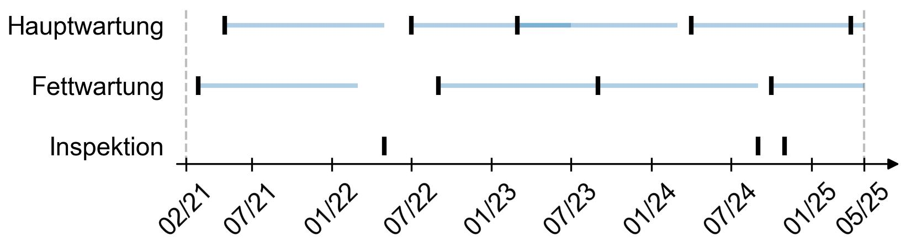

# Timeline Editor

A graphical tool for creating and exporting customized timeline visualizations based on date inputs. Built with Python and `tkinter`, this application allows users to enter events, intervals, and date points, visualize the result as a timeline, and save the output as a `.png` image.

---

## Features

- GUI-based timeline creation with support for multiple entries
- Supports:
  - Event names (titles)
  - Monthly intervals (in months)
  - Dates in `mm/yy` format
- Inline data validation with helpful error messages
- Live preview of the timeline before export
- Exports the timeline as a high-resolution `.png` image
- Designed for integration with inspection/logbook databases (optional)

---

## Example Use Case

**Input:**
- Title: `Project Phase 1`
- Interval: `6`
- Dates: `01/24`, `07/24`

**Output:**
- Timeline showing vertical date markers and horizontal bars for intervals, labeled with your titles.

---

## Getting Started

### Requirements

- Python 3.7+
- Required libraries:
  - `matplotlib`
  - `tkinter` (included with standard Python installations)
  - `python-dateutil`
